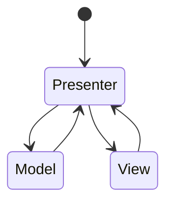

# Mobirix MVP Framework Ver 1.0.3

## - MVP Patten

### 1. Presenter

Presenter.Bind(string domain, View view)
    공유데이터 View 구독

Presenter.UnBind(string domain, View view)
    공유데이터 View 구독해지

Presenter.Send(string domain, string key, IModel data)
    View 에 IModel 송신

### 2. View

View.ViewQuick(string key, IModel data)

Quick데이터 수신

## - UI System

1.  UIManager.ShowPopup(string name)

        팝업 켜기

2.  UIManager.ClosePopup(UIScreen screen)
    UIManager.ClosePopup(string screen)

        팝업 끄기

## - GoogleSheetEditor

1.  메뉴

        Tools -> DownloadGoogleSheet

2.  입력

        SheetName 입력
        URL 입력
        
## - ObjectPooling

1.  ObjectPooling.Create(string name)

        Resources/PoolingObjects 폴더에 있는 프리팹을 생성하거나  활성화 되지 않은 프리팹을 재활용 함

2.  ObjectPooling.Destroy(GameObject returnObject)

        비활성 오브젝트로 만듬

## - TimeManager

Timer.Create(float duration, Action callback, bool repeat = false)

    타이머 생성

## - Ultimate Build Menu

빌드 파이프

[해당 링크 참조](https://assetstore.unity.com/packages/tools/utilities/ultimate-build-menu-233545?locale=ko-KR)

## -Asset-Palette

에셋 팔레트

게임 개발 중에 현재 디자인하고 있는 레벨에 속하는 모든 소품과 같은 매우 작은 자산 그룹을 많이 사용하는 레벨 디자인과 같은 특정 워크플로가 있다는 것을 알게 되었습니다. 이러한 에셋을 프로젝트의 동일한 폴더에 두는 것이 항상 이치에 맞는 것은 아닙니다. 때로는 파일이 프로젝트에 있는 위치에 관계없이 사용자 지정 에셋 그룹을 만들고 싶을 수도 있습니다.

[해당 링크 참조](https://github.com/RoyTheunissen/Asset-Palette)

## - Game Package Manager

Game Package Manager는 NHN에서 게임 제작에 필요한 서비스들을 무료로 제공하는 브랜드입니다.

[해당 링크 참조](https://github.com/nhn/gpm.unity)

## - HierarchyDecorator

Hierarchy Decorator는 Unity의 계층 구조를 확장하고 다음 단계로 끌어올리는 Unity 2018.4 이상의 확장 기능입니다.

[해당 링크 참조](https://github.com/WooshiiDev/HierarchyDecorator)

## - NaughtyAttributes

NaughtyAttributes는 Unity Inspector의 확장입니다.

[해당 링크 참조](https://github.com/dbrizov/NaughtyAttributes)

### - QuickEye-Utility

QuickEye 유틸리티

[해당 링크 참조](https://github.com/ErnSur/QuickEye-Utility)

## - UTween

**UTween은** **Unity** 용 보간 애니메이션 구성 요소입니다 . 내장 구성 요소를 통해 애니메이션을 빠르게 구성하거나 코드를 통해 애니메이션을 작성할 수 있습니다.

[해당 링크 참조](https://github.com/ls9512/UTween)

## - Vibration

모바일에서 사용자 정의 진동을 사용하십시오.

[해당 링크 참조](https://github.com/BenoitFreslon/Vibration)
